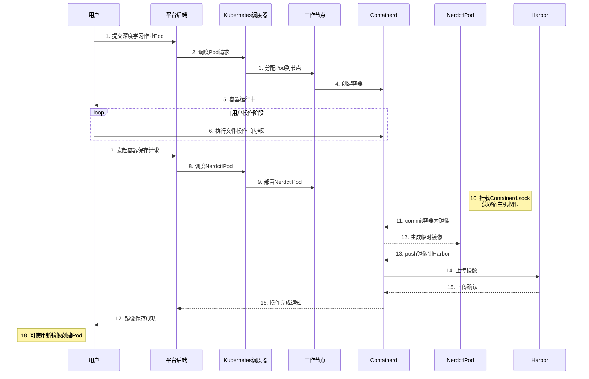

## 需求背景

用户将 Kubernetes 上的容器当作虚拟机使用，希望保存在容器内的改动。

## 流程设计

```mermaid
sequenceDiagram
    participant 用户
    participant 平台后端
    participant Kubernetes调度器
    participant 工作节点
    participant Containerd
    participant NerdctlPod
    participant Harbor

    用户 ->> 平台后端: 1. 提交深度学习作业Pod
    平台后端 ->> Kubernetes调度器: 2. 调度Pod请求
    Kubernetes调度器 ->> 工作节点: 3. 分配Pod到节点
    工作节点 ->> Containerd: 4. 创建容器
    Containerd -->> 用户: 5. 容器运行中

    loop 用户操作阶段
        用户 ->> Containerd: 6. 执行文件操作（内部）
    end

    用户 ->> 平台后端: 7. 发起容器保存请求
    平台后端 ->> Kubernetes调度器: 8. 调度NerdctlPod
    Kubernetes调度器 ->> 工作节点: 9. 部署NerdctlPod
    Note right of NerdctlPod: 10. 挂载Containerd.sock<br/>获取宿主机权限

    NerdctlPod ->> Containerd: 11. commit容器为镜像
    Containerd -->> NerdctlPod: 12. 生成临时镜像
    NerdctlPod ->> Containerd: 13. push镜像到Harbor
    Containerd ->> Harbor: 14. 上传镜像
    Harbor -->> Containerd: 15. 上传确认
    Containerd -->> 平台后端: 16. 操作完成通知
    平台后端 -->> 用户: 17. 镜像保存成功

    Note left of 用户: 18. 可使用新镜像创建Pod
```
