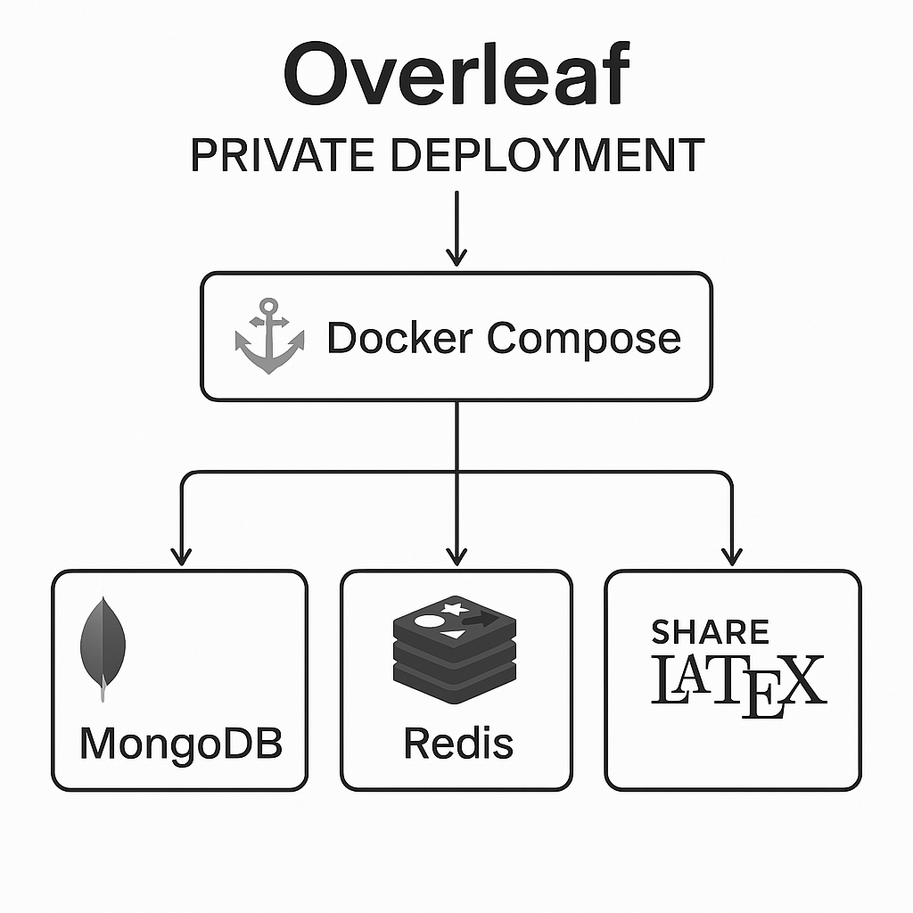

## 背景介绍

实验室有若干个 Kubernetes 裸金属集群，这些集群已经配置了 MetalLB 的负载均衡器、以及基于 Ingress Nginx 的集群网关。

最近需要和课题组的小伙伴（共 8 人）一起拼好「论文」，Overleaf 在线免费版无法满足这么多人的协作需求，于是起了私有化部署的念头。同时因为集群的资源还很空闲，最终决定在 Kubernetes 上进行部署，本文主要记录了相关原理、过程和踩的坑。

## 1. Overleaf 部署原理

Overleaf 官方提供了 [Docker 镜像](https://github.com/overleaf/overleaf?tab=readme-ov-file#overleaf-docker-image)以及 [Docker Compose 的脚本](https://github.com/overleaf/overleaf/blob/main/docker-compose.yml)，这些都是我们部署在 Kubernetes 上的重要参考。

### 1.1 Overleaf 镜像

官方具体提供了两种镜像：

- `sharelatex/sharelatex-base`：包含基本依赖项，如  `wget`、`texlive` 等。
- `sharelatex/sharelatex`：包含实际的 Overleaf 代码和服务。

这些镜像可以在 DockerHub 上找到，同时官方也提供了用于构建镜像的源码。注意到 [sharelatex/sharelatex](https://hub.docker.com/r/sharelatex/sharelatex/tags) 镜像最近一次更新，是 5 天前的 `5.4.0` 版本，可见更新和维护都非常及时，因此没有考虑从零构建，而是直接在社区提供的 `sharelatex/sharelatex` 基础上进行修改。

进一步的，由于我要编译的论文是中文论文，需要使用 `ctex` 等宏包，我们需要在官方镜像的基础上，安装更多所需宏包。

为了方便，我直接安装大多数宏包（在任何一门编程语言都很罕见，但在 LaTeX 倒也正常）：

```dockerfile
# 使用社区提供的基础镜像，如果无法访问 DockerHub，可以使用一些代理镜像站点
FROM sharelatex/sharelatex:5.4.0

# 1. 配置 Tex Live 的包管理器使用国内清华源的代理
# 2. 安装 `scheme-full` 表示的绝大多数宏包
# 3. 安装 fandol 中文字体
RUN tlmgr option repository https://mirrors.tuna.tsinghua.edu.cn/CTAN/systems/texlive/tlnet && \
    tlmgr install scheme-full && \
    tlmgr install fandol
```

- CTAN 镜像站使用帮助：[清华大学开源软件镜像站 | Tsinghua Open Source Mirror](https://mirrors.tuna.tsinghua.edu.cn/help/CTAN/)
- `scheme-full`  是 TeX Live 预定义的一个大型集合，包含了绝大多数常用宏包。
- `Fandol` 是一个来自已经破产的公司的中文字体套件，专门为 LaTeX 设计，包含宋体、黑体、仿宋和楷体四种基本字体。

编译上述 `dockerfile`，这将作为我们后续实际运行的 Overleaf 实例所使用的镜像。

### 1.2 Overleaf 运行逻辑

在 Docker Compose 文件中，我们可以发现三个主要组件：

1. 在上一小节提到的 Overleaf 核心镜像，名称则是 shareLaTeX
1. MongoDB，相比传统的关系型数据库，这是一个非结构化的数据库
1. Redis，这是一个键值数据库，常用于缓存场景



因此，在需要部署到 Kubernetes 时，我们同样需要这三个组件。

## 2. 安装 Overleaf

在进行了基本原理的学习后，我参考 abompotas/k8s-overleaf 项目提供的 Helm 和 Kubernetes 脚本，进行了安装。相关的代码开源在了 [raids-lab/k8s-overleaf](https://github.com/raids-lab/k8s-overleaf)。

### 2.1 配置 MongoDB 和 Redis 的 Helm 镜像

Helm 是用于安装 Kubernetes 应用程序的得力助手，MongoDB 和 Redis 都是非常常用的软件包，为此有一家名为 Bitnami 的公司，专注于降低部署这件事情的复杂度，让开发者专注于业务逻辑而非环境配置。Bitnami 提供了各种主流应用的 Helm Chart，我们直接使用即可。

但在实际部署过程中，由于我们无法直接访问 Docker Hub，需要将 Bitnami 软件包的镜像设置为可访问的代理镜像站。同时，由于 Bitnami 不希望用户篡改他们的基础镜像，而引发一些非标准的问题，我们还需要配置允许对镜像连接的修改。

```yaml
global:
  security:
    allowInsecureImages: true    # 允许对 registry 的修改
image:
  registry: xxx.xxx.cn/docker.io # 镜像站代理的位置
```

### 2.2 配置 Overleaf 的环境变量

> [!NOTE] [Configuring Overleaf](https://github.com/overleaf/overleaf/wiki/Configuring-Overleaf)

Overleaf 通过一系列环境变量来完成对服务的配置。而在 Kubernetes 的场景下，我们计划通过一个 ConfigMap 完成对这些环境变量的定义，并在 Deployment 的配置中，从 ConfigMap 读取这些配置到环境变量中。

具体可以配置的选项，请查看官方 Wiki，在这里我配置了一些基本功能：

```yaml
apiVersion: v1
data:
  OVERLEAF_SITE_URL: https://overleaf.xxx.xxx.edu.cn
  OVERLEAF_BEHIND_PROXY: "true"
  EMAIL_CONFIRMATION_DISABLED: "true"     # 禁用邮箱验证功能
  ENABLE_CONVERSIONS: "true"
  ENABLED_LINKED_FILE_TYPES: project_file,project_output_file
  EXTERNAL_AUTH: none
  OVERLEAF_APP_NAME: RAIDS Lab Overleaf   # 打上实验室 LOGO
  OVERLEAF_MONGO_URL: mongodb://mongo-mongodb-headless.overleaf.svc.cluster.local/sharelatex # Kubernetes 服务
  OVERLEAF_REDIS_HOST: redis-headless.overleaf.svc.cluster.local # Kubernetes 服务
  REDIS_HOST: redis-headless.overleaf.svc.cluster.local # Kubernetes 服务
  REDIS_PORT: "6379"
kind: ConfigMap
metadata:
  labels:
    io.kompose.service: sharelatex-variables
  name: sharelatex-variables
```

### 2.3 配置外部对 Overleaf 的访问

为了在 Kubernetes 中暴露 Overleaf 服务，我们需要给 Overleaf 加上 Service 和 Ingress。

这里需要注意的是，一开始我直接使用了参考项目中的 Service 模板，但 Pod 直接失败，没有执行 Migrate 等初始化操作，报错信息如下：

```shell
                   ShareLaTeX to Overleaf rebranding
                   ---------------------------------

  Starting with version 5.0, ShareLaTeX branded variables are no
   longer supported as we are migrating to the Overleaf brand.

  Your configuration still uses 8 ShareLaTeX environment variables:
      - SHARELATEX_SERVICE_PORT_80
      - SHARELATEX_SERVICE_HOST
      - SHARELATEX_PORT_80_TCP
      - SHARELATEX_PORT_80_TCP_ADDR
      - SHARELATEX_PORT
      - SHARELATEX_SERVICE_PORT
      - SHARELATEX_PORT_80_TCP_PROTO
      - SHARELATEX_PORT_80_TCP_PORT
```

大概意思是 Overleaf 的环境变量已经更新，带有 `SHARELATEX` 前缀的变量不再受到支持，以至于直接终止了命令。但我在 Deployment 的配置中并没有带有 `SHARELATEX` 前缀的变量。

原因正和 Kubernetes 自动注入 Service 的环境变量有关。我们需要将服务名称从"sharelatex"改为"overleaf"，这样 Kubernetes 就会生成 `OVERLEAF` 前缀的环境变量而不是 `SHARELATEX` 前缀，从而不干扰到 Overleaf 程序的启动。

之后，我们为项目配置 Ingress 路由，我们先使用脚本，将 TLS 证书添加到 Overleaf 命名空间下的 Secret 中，之后在 Ingress 中设置好路由规则和证书。

观察到 Ingress 已经成功启动了服务，分配好了 IP，并且实验室内的 DNS 服务也正常解析了：

```shell
$ kubectl get ingress -n overleaf
NAME       CLASS   HOSTS                             ADDRESS        PORTS     AGE
overleaf   nginx   overleaf.xx.xx.edu.cn   192.168.5.57   80, 443   3d5h

$ nslookup overleaf.xx.xx.edu.cn
Server:         xx.xx.xx.xx
Address:        xx.xx.xx.xx#53

Non-authoritative answer:
Name:   overleaf.xx.xx.edu.cn
Address: 192.168.5.57
```

之后访问网址，已经能看到 Overleaf 页面了，部署成功。

## 3. 本地 Overleaf 使用

### 3.1 新建管理员用户

> [!NOTE] [Creating and managing users](https://github.com/overleaf/overleaf/wiki/Creating-and-managing-users)

刚打开 Overleaf 本地版的我有些手足无措，怎么没有办法注册呢？在阅读文档之后我了解到，为了创建第一个用户，具体有两种方法：

1. 访问 `/launchpad` 并创建第一个用户
1. 在容器内手动运行命令

### 3.2 如何邀请其他用户

之后为了添加其他用户，可以批量输入邮箱，Overleaf 会批量生成邀请链接。

到这里部署流程就告一段落，抓紧时间写出论文吧~

## 问题记录

### 1. Overleaf 报错使用了 ShareLaTeX 环境变量

> [!NOTE] [Configuring Overleaf](https://github.com/overleaf/overleaf/wiki/Configuring-Overleaf)

Pod 直接失败，没有执行 Migrate 等初始化操作，报错信息如下：

```shell
Warning: Use tokens from the TokenRequest API or manually created secret-based tokens instead of auto-generated secret-based tokens.
*** Running /etc/my_init.d/000_check_for_old_bind_mounts_5.sh...
*** Running /etc/my_init.d/000_check_for_old_env_vars_5.sh...
------------------------------------------------------------------------

                   ShareLaTeX to Overleaf rebranding
                   ---------------------------------

  Starting with version 5.0, ShareLaTeX branded variables are no
   longer supported as we are migrating to the Overleaf brand.

  Your configuration still uses 8 ShareLaTeX environment variables:
      - SHARELATEX_SERVICE_PORT_80
      - SHARELATEX_SERVICE_HOST
      - SHARELATEX_PORT_80_TCP
      - SHARELATEX_PORT_80_TCP_ADDR
      - SHARELATEX_PORT
      - SHARELATEX_SERVICE_PORT
      - SHARELATEX_PORT_80_TCP_PROTO
      - SHARELATEX_PORT_80_TCP_PORT

  Please either replace them with the "OVERLEAF_" prefix,
   e.g. SHARELATEX_MONGO_URL -> OVERLEAF_MONGO_URL, or
   remove old entries from your configuration.

  You can use the following script for migrating your config.

  Overleaf toolkit setups:

    github.com/overleaf/toolkit$ bin/upgrade
    github.com/overleaf/toolkit$ bin/rename-env-vars-5-0.sh


  Legacy docker compose setups/Horizontal scaling setups:

    github.com/overleaf/overleaf$ git pull
    github.com/overleaf/overleaf$ server-ce/bin/rename-env-vars-5-0.sh

    # When using a docker-compose.override.yml file (or other file name):
    github.com/overleaf/overleaf$ server-ce/bin/rename-env-vars-5-0.sh docker-compose.override.yml


  Other deployment methods:

    Try using the docker compose script or get in touch with support.


  Refusing to startup, exiting in 10s.

------------------------------------------------------------------------
*** /etc/my_init.d/000_check_for_old_env_vars_5.sh failed with status 101

*** Killing all processes...
```

但很疑惑的是我在传递环境变量时，并没有设置这些信息。

最后发现和 Kubernetes 自动注入 Service 的环境变量有关。我们需要将服务名称从"sharelatex"改为"overleaf"，这样 Kubernetes 就会生成 `OVERLEAF` 前缀的环境变量而不是 `SHARELATEX` 前缀。
