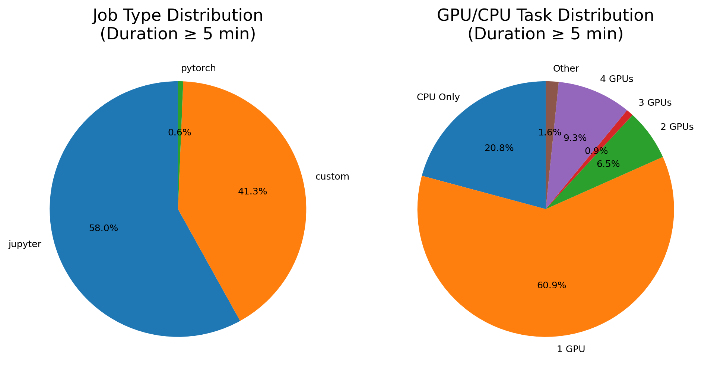
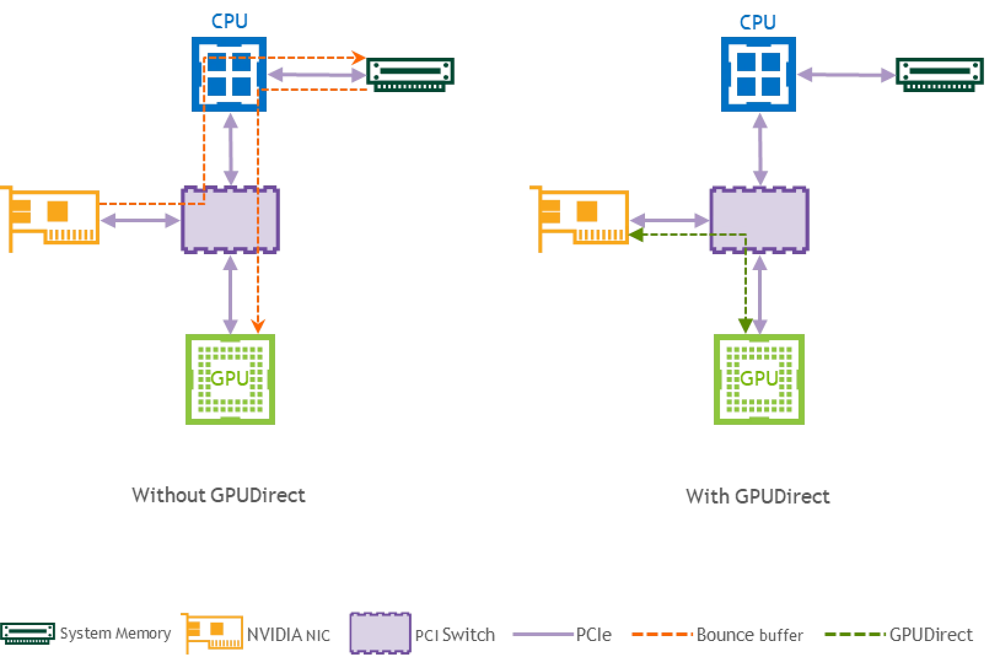
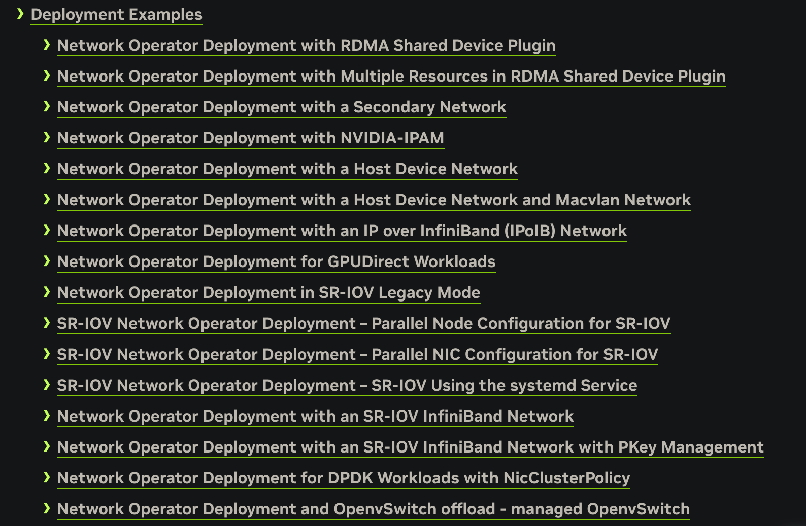
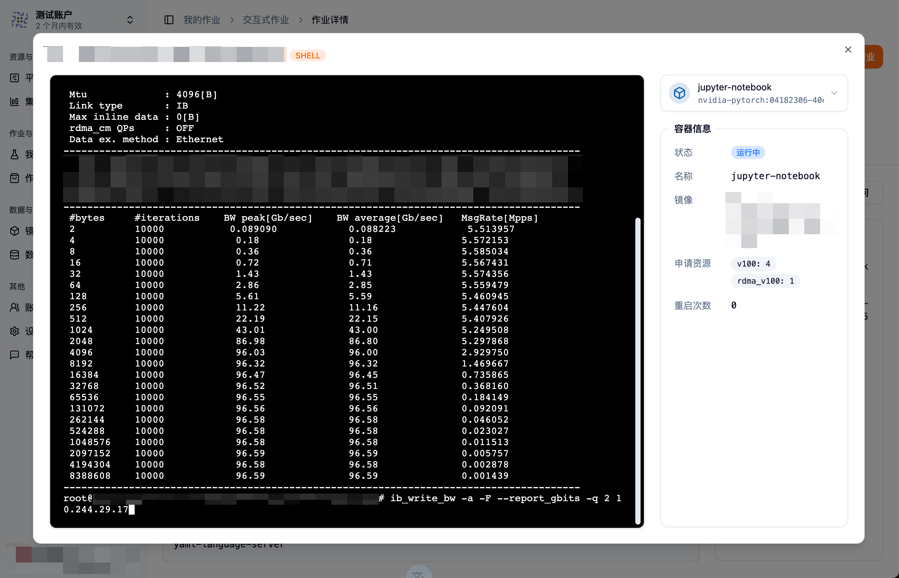
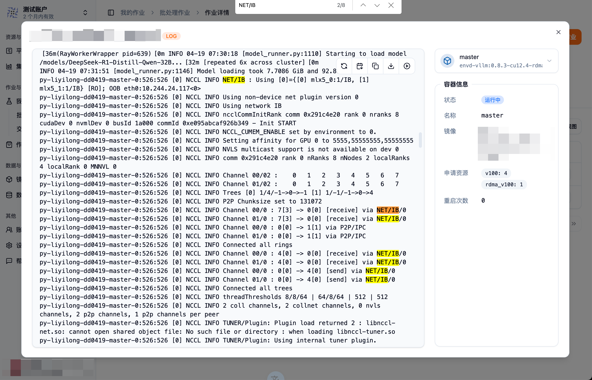

## 背景介绍

实验室有一批 V100 和 A100 的机器，从今年年初，我们将这些机器从传统的 Slurm 调度系统，迁移到了以 Kubernetes 为基座的云原生机器学习平台上。

对于我们平台的用户（学校的老师和学生们），这是实验室四个多月作业类型、卡数分布占比，可以发现绝大多数的作业还是以单机或者单卡为主的小作业。



因此之前，Kubernetes 集成 **RDMA (Remote Direct Memory Access)** 这件事情的优先级并不高。但最近，我们在实验室部署了 vLLM 多机推理 DeepSeek 模型，在不使用 RDMA 的情况下，多机通信会走实验室的万兆网络，可以发现峰值 IO 在 1.25GB/s 左右，几乎占满了万兆带宽。


这会对其他服务的网络通信（比如存储、流量延迟）造成严重影响。同时模型的吞吐量也会受限于带宽。

为此我进行了 Kubernetes 集群支持 RDMA 的尝试。

## InfiniBand 知识学习

> [!NOTE]
>
> - [K8s test via Infiniband network - Adapters and Cables / InfiniBand/VPI Adapter Cards - NVIDIA Developer Forums](https://forums.developer.nvidia.com/t/k8s-test-via-infiniband-network/285610)
> - [Running tightly coupled HPC/AI workloads with InfiniBand using NVIDIA Network Operator on AKS | Microsoft Community Hub](https://techcommunity.microsoft.com/blog/azurehighperformancecomputingblog/running-tightly-coupled-hpcai-workloads-with-infiniband-using-nvidia-network-ope/4117209)
> - [Basic Knowledge and Differences of RoCE, IB, and TCP Networks](https://support.huawei.com/enterprise/en/doc/EDOC1100203339)

在正式开始前，我们先补足一些和 RDMA 相关的基础知识：



- **RDMA**：是一种绕过操作系统内核的网络通信技术，其核心在于通过网卡直接访问远端内存，避免了传统 TCP/IP 协议栈的数据拷贝和上下文切换开销。
- **NVIDIA GPU Direct**[^2]：实现 GPU 显存与网卡 DMA 引擎的直接对接，当 GPU 需要与远端节点通信时，数据可直接通过 InfiniBand 或 RoCE 网卡传输，无需经过主机内存中转。
- **网络虚拟化**：Macvlan 和 SR-IOV 是两种常见的网络虚拟化方案。Macvlan 允许为容器创建虚拟网卡接口，使其在物理网络上显示为独立设备；而 SR-IOV 通过物理网卡的硬件虚拟化能力，将单个物理功能（PF）划分为多个虚拟功能（VF），每个 VF 都能直接分配给 Pod 使用。
- **技术路径**：目前 RDMA 主要有 InfiniBand 与 RoCE 两种实现方式[^6]。InfiniBand 原生支持 RDMA 协议，需要专用交换机和子网管理器构建独立网络，成本高昂；而 RoCEv2 则基于传统以太网基础设施，通过 PFC 和 ECN 等流控机制保障无损传输，被互联网公司广泛使用。

我们实验室采用的是 InfiniBand 方案，为此首先检查相关设备的 IB 信息：

### 1. 在单节点测试 InfiniBand 相关信息

先在宿主机上进行测试，在上云之前这些机器的 IB 都是通的：

```bash
$ ibdev2netdev
mlx5_0 port 1 ==> ibxxxxxx0 (Up)
mlx5_1 port 1 ==> ibxxxxxx1 (Up)

$ ibstat
CA 'mlx5_0'
        Port 1:
                Link layer: InfiniBand
CA 'mlx5_1'
        Port 1:
                Link layer: InfiniBand
```

- **Up**: 表示该 InfiniBand 端口已成功激活并与网络建立了连接
- **Down**: 表示该 InfiniBand 端口未激活或未能建立网络连接

### 2. 使用 Ansible 批量查看节点网卡

划分组：

```toml
[ib-v100]
xx.xx.xx.[xx:xx]

[ib-a100]
xx.xx.xx.[xx:xx]
```

编写批量查询脚本：

```yaml
---
- name: Run ibdev2netdev on InfiniBand hosts
  hosts: ib-v100,ib-a100
  gather_facts: no

  tasks:
    - name: Execute ibdev2netdev command
      ansible.builtin.command: ibdev2netdev
      register: ibdev_output
      changed_when: false

    - name: Display ibdev2netdev output
      ansible.builtin.debug:
        var: ibdev_output.stdout_lines
```

由于返回值太长，就不贴完整的了。从 `ibdev2netdev` 输出结果来看，集群两类节点的 InfiniBand 配置有所不同：

#### V100 节点

```
mlx5_0 port 1 ==> ibxxxxxx0 (Up)
mlx5_1 port 1 ==> ibxxxxxx1 (Up)
```

这些节点每个节点上都有一张双端口的 IB 网卡，每个端口的最大速率为 100Gbp/s，分别连接到 2 台 36 端口的 IB 交换机上，2 个交换机之间还有 4 条 100Gbps 的互联线。

- 每个节点有两个独立的 InfiniBand 端口 (mlx5_0 和 mlx5_1)
- 两个端口都处于 Up 状态

#### A100 节点

```
mlx5_0 port 1 ==> ibxxxx0 (Down/Up)
mlx5_1 port 1 ==> ibxxxxx0 (Up/Down)
mlx5_bond_0 port 1 ==> bond0 (Up)
```

这批机器每台插了 2 块 200Gbps 的 IB 卡，用 1 个 IB 交换机互联。有三个条目，因为配置了**链路聚合(bonding)**，并采用主动-备用(active-backup)绑定模式[^1]，

前两个是物理端口，第三个是绑定端口；bond0 始终为 Up，因为它是逻辑聚合接口。RDMA 网卡的 Bond 支持 3 种模式：

- 模式 1（主备）
- 模式 2（负载均衡）
- 模式 4（链路聚合）


这样的 Bond 结构可能会对 Kubernetes 中使用 RDMA 设备插件产生一些影响。

后续在 Kubernetes 中安装 RDMA 设备插件时，就需要网口信息。

## 安装 Nvidia Network Operator

> [!NOTE] [Network Operator Deployment on Vanilla Kubernetes Cluster](https://docs.nvidia.com/networking/display/kubernetes2501/getting-started-kubernetes.html#network-operator-deployment-on-vanilla-kubernetes-cluster)

目前最推荐的在 Kubernetes 中集成 RDMA 的方式是通过 Nvidia Network Operator，参考官方文档，首先采用 Helm 安装 Operator 主程序。后续具体采用何种 RDMA 接入方案，则通过再部署一个 CR 来实现。

首先添加 Helm 仓库：

```bash
helm repo add nvidia https://helm.ngc.nvidia.com/nvidia
```

接着跟着文档走，把 `values.yaml` 下载到本地。主要看看 NFD 是否需要关闭，以及镜像替换成国内可以访问的镜像地址。

由于我们集群之前已经部署好了 Nvidia GPU Operator，因此选择将 NFD 选项关闭。

> [!WARNING]
> Since several parameters should be provided when creating custom resources during operator deployment, it is recommended to use a configuration file. While it is possible to override the parameters via CLI, we recommend to avoid the use of CLI arguments in favor of a configuration file.

```bash
helm show values nvidia/network-operator --version v25.1.0 > values.yaml
```

之后安装最新版本（v25.1.0）的 Nvidia Network Operator 程序：

```bash
helm upgrade --install network-operator nvidia/network-operator \
-n nvidia-network-operator \
--create-namespace \
--version v25.1.0 \
-f ./values.yaml \
--wait
```

安装后，`nvidia-network-operator` 命名空间下会出现 Operator 的 Pod，此时 RDMA 并没有配置好，还需要结合具体的策略。

```bash
$ kubectl get pods -l app.kubernetes.io/name=network-operator
NAME                               READY   STATUS    RESTARTS      AGE
network-operator-xxxxxxxx-xxxxx   1/1     Running   1 (22h ago)   26h
```

## 设置 `NicClusterPolicy`

对于一个初学者来说，这里的文档实在是有些晦涩：



可以看到在 Deployment Examples（部署示例）一章，有近 20 种部署方式。那么——

1. 这些部署方式在性能上的差异是怎样的？
1. 如何选择适合自己的部署方式？
1. 部署之后如何让 Pod 接入 RDMA 等高性能网络？
1. 容器运行 RDMA 测试的最低要求是什么？
1. 如何在容器中测试 RDMA 网络？
1. 常见的错误和解决方案是怎样的？

文档没有回答这些问题，因此我的摸索也是非常困难。先快速总结一下当前阶段，我对这些问题的理解和参考资料：

- **性能差异**：[IPoIB (IP over InfiniBand) vs. RDMA performance](https://serverfault.com/questions/876403/ipoib-ip-over-infiniband-vs-rdma-performance)，此外 Shared Device Plugin 在只有一个 Pod 申请资源时，带宽差不多能打满；多个的情况还没有测试过
- **部署方式**：目前先采用了 RDMA Shared Device Plugin 的方式，在 V100 上运行正常；但不太清楚这种方式能否使用聚合后的网卡，后续可能会切换到 Host Network 模式？
- **资源申请**：安装后一般节点会新增和 RDMA 相关资源，有些情况还需要在 Annotations 中标记要使用的辅助网络（比如 Multus 或者 Macvlan？）
- **最低要求**：[验证镜像是否支持 RDMA--机器学习平台-火山引擎](https://www.volcengine.com/docs/6459/119595)
- **如何测试**：[Prepare a cluster for running RDMA workloads and GPU-Direct RDMA workloads.](https://github.com/Mellanox/network-operator/tree/master/example)
- **错误和解决方案**：见本文末尾

### 1. 尝试配置 RDMA Shared Device Plugin

> [!NOTE] [Network Operator Deployment with Multiple Resources in RDMA Shared Device Plugin](https://docs.nvidia.com/networking/display/kubernetes2501/getting-started-kubernetes.html#network-operator-deployment-with-multiple-resources-in-rdma-shared-device-plugin)

由于我的单一集群中存在两个不同的 IB 网络（V100 和 A100），我使用文档中提到的 Multiple Resources 的配置方法，分别指定 V100 和 A100 的端口，上报 `rdma/rdma_v100` 和 `rdma/rdma_a100` 的网络资源。

```yaml
apiVersion: mellanox.com/v1alpha1
kind: NicClusterPolicy
metadata:
  name: nic-cluster-policy
spec:
  ofedDriver:
    image: doca-driver
    repository: nvcr.io/nvidia/mellanox
    version: 25.01-0.6.0.0-0
    forcePrecompiled: false
    imagePullSecrets: []
    terminationGracePeriodSeconds: 300
    startupProbe:
      initialDelaySeconds: 10
      periodSeconds: 20
    livenessProbe:
      initialDelaySeconds: 30
      periodSeconds: 30
    readinessProbe:
      initialDelaySeconds: 10
      periodSeconds: 30
    upgradePolicy:
      autoUpgrade: true
      maxParallelUpgrades: 1
      safeLoad: false
      drain:
        enable: true
        force: true
        podSelector: ""
        timeoutSeconds: 300
        deleteEmptyDir: true
  rdmaSharedDevicePlugin:
    # [map[ifNames:[ens1f0 ens1f1] name:rdma_shared_device_a] map[ifNames:[ens2f0 ens2f1] name:rdma_shared_device_b]]
    repository: ghcr.io/mellanox
    image: k8s-rdma-shared-dev-plugin
    version: v1.5.2
    imagePullSecrets: []
    # The config below directly propagates to k8s-rdma-shared-device-plugin configuration.
    # Replace 'devices' with your (RDMA capable) netdevice name.
    config: |
      {
        "configList": [
          {
            "resourceName": "rdma_v100",
            "rdmaHcaMax": 63,
            "selectors": {
              "ifNames": ["ibxxxxxx0","ibxxxxxx1"],
              "linkTypes": ["infiniband"]
            }
          },
          {
            "resourceName": "rdma_a100",
            "rdmaHcaMax": 63,
            "selectors": {
              "ifNames": ["ibxxxx0","ibxxxxx0"],
              "linkTypes": ["infiniband"]
            }
          }
        ]
      }

```

部署完成后，注意到启动了 DaemonSets。得益于 NFD 功能，并不会在没有 IB 网卡（15b3）的节点上安装。

```bash
$ kg daemonset
NAME                              DESIRED   CURRENT   READY   UP-TO-DATE   AVAILABLE   NODE SELECTOR                                                                                                                                                                                                                             AGE
mofed-ubuntu22.04-xxxxxxxxx-ds   36        36        36      36           36          feature.node.kubernetes.io/kernel-version.full=5.15.0-134-generic,feature.node.kubernetes.io/pci-15b3.present=true,feature.node.kubernetes.io/system-os_release.ID=ubuntu,feature.node.kubernetes.io/system-os_release.VERSION_ID=22.04   24h
rdma-shared-dp-ds                 36        36        36      36           36          feature.node.kubernetes.io/pci-15b3.present=true,network.nvidia.com/operator.mofed.wait=false
```

Nvidia Network Operator 的安装包含 Ofed 驱动和 Device Plugin，前者需要 privilege 权限，会影响宿主机的 IB 驱动。在我的测试过程中，就导致一台 A100 节点的 IB 网卡大量报错，错误日志写满了系统盘，进而中断了数小时的服务。

所有 Pod 都 Running 后，验证节点上是否新增资源：

```bash
$ kubectl get nodes -o json | jq -r '.items[] | {
    name: .metadata.name,
    "rdma/rdma_v100": .status.capacity["rdma/rdma_v100"]
} | select(.["rdma/rdma_v100"] != null)'
# 省略相同的结果
{
  "name": "xxx-v100-xx",
  "rdma/rdma_v100": "63"
}
{
  "name": "xxx-a100-xx",
  "rdma/rdma_a100": "63"
}
```

到这里，基于 RDMA Shared Device Plugin 的安装方式就告一段落了。字节跳动的火山引擎中的部分产品似乎就是用的这种方式。

### 2. 尝试配置 GPUDirect Workloads (未成功)

> [!NOTE] [Network Operator Deployment for GPUDirect Workloads](https://docs.nvidia.com/networking/display/kubernetes2501/getting-started-kubernetes.html#network-operator-deployment-for-gpudirect-workloads)

本节主要是对过程中失败尝试的记录，如果您对 RDMA Shared Device Plugin 后续如何验证更感兴趣，可以直接跳到下一节。

由于在配置 RDMA Shared Device Plugin （下简称方法 1）的过程中，我遇到了一些其他问题，导致我错以为方法 1 的路子走不通，并且在 K8s RDMA Shared Dev Plugin 项目的讨论区，还有人说了这样一段话[^3]（虽然底下就有人给出反例，但当时我没调通，以为已经过时）：

> [!NOTE] [Adrian Chiris](https://github.com/adrianchiris)
>
> We should improve the projects README.
>
> the general way to use it with k8s is utilizing secondary network CNI such as macvlan or ipoib (or any CNI essentially can create virtual interfaces on top of existing RDMA capable parent netdev)
> **将其与 K8s 一起使用的一般方法是使用辅助网络 CNI，例如 macvlan 或 ipoib（或者任何 CNI 基本上可以在支持 RDMA 的现有父 netdev 之上创建虚拟接口）**
>
> we should update instructions and examples.

于是我又读文档，发现有一节叫作「GPUDirect Workloads」（内心 OS：难道其他的安装方式都不是 GPU Workloads 吗？）。

相比方法 1，这种方法需要安装 DOCA driver、SR-IOV Device Plugin、Secondary network、Multus CNI、Container Networking plugins、IPAM plugin，其中 Multus CNI 正是 Kubernetes 中的一种辅助网络 CNI[^4]。

> [!NOTE]
>
> - **Multus** 是一种 CNI（容器网络接口）插件，它允许在一个 Kubernetes Pod 中插入多张网卡，从而实现更灵活的网络通信。支持多种 CNI 插件，例如 Flannel、Calico、Macvlan 等，能够很好地与其他网络解决方案集成。在某些场景下，可能需要 Pod 同时连接到多个不同的网络，Multus 就可以实现这样的功能，为 Pod 提供多个网络接口，使其能够与不同的网络进行通信。
> - **Whereabouts** 则是一个 IP 地址管理工具，它能够自动为 Pod 分配 IP 地址，并且可以避免 IP 地址冲突的情况。在传统的网络配置中，可能需要手动为每台主机分配不同的 IP 地址范围，以防止 IP 地址冲突。而 Whereabouts 通过其自动化的 IP 地址分配机制，简化了这一过程，使得在 Kubernetes 集群中管理 IP 地址变得更加高效和可靠。它能够确保每个 Pod 获得唯一的 IP 地址，即使在大规模的集群环境中，也能够有效地避免 IP 地址重复的问题。

部署时，首先安装 Nic Cluster Policy：

```yaml
apiVersion: mellanox.com/v1alpha1
kind: NicClusterPolicy
metadata:
  name: nic-cluster-policy
spec:
  ofedDriver:
    image: doca-driver
    repository: nvcr.io/nvidia/mellanox
    version: 25.01-0.6.0.0-0
    forcePrecompiled: false
    imagePullSecrets: []
    terminationGracePeriodSeconds: 300
    startupProbe:
      initialDelaySeconds: 10
      periodSeconds: 20
    livenessProbe:
      initialDelaySeconds: 30
      periodSeconds: 30
    readinessProbe:
      initialDelaySeconds: 10
      periodSeconds: 30
    upgradePolicy:
      autoUpgrade: true
      maxParallelUpgrades: 1
      safeLoad: false
      drain:
        enable: true
        force: true
        podSelector: ""
        timeoutSeconds: 300
        deleteEmptyDir: true
  sriovDevicePlugin:
    image: sriov-network-device-plugin
    repository: ghcr.io/k8snetworkplumbingwg
    version: v3.9.0
    imagePullSecrets: []
    config: |
      {
        "resourceList": [
          {
            "resourcePrefix": "nvidia.com",
            "resourceName": "hostdev",
            "selectors": {
              "vendors": ["15b3"],
              "devices": [],
              "drivers": [],
              "pfNames": [],
              "pciAddresses": [],
              "rootDevices": [],
              "linkTypes": [],
              "isRdma": true
            }
          }
        ]
      }
  secondaryNetwork:
    cniPlugins:
      image: plugins
      repository: ghcr.io/k8snetworkplumbingwg
      version: v1.5.0
      imagePullSecrets: []
    multus:
      image: multus-cni
      repository: ghcr.io/k8snetworkplumbingwg
      version: v4.1.0
      imagePullSecrets: []
    ipamPlugin:
      image: whereabouts
      repository: ghcr.io/k8snetworkplumbingwg
      version: v0.7.0
      imagePullSecrets: []
```

之后需要指定 Where Abouts 的可分配 IP，不能和当前二层网络下的已占用 IP 重复（这一点有点像 Metal LB 做的事情？）。为此我先扫描了一遍，然后挑出了一个没有被使用的小 IP 段。

```yaml
apiVersion: mellanox.com/v1alpha1
kind: HostDeviceNetwork
metadata:
  name: hostdevice-net
spec:
  networkNamespace: "crater-workspace" # Workloads 所在的命名空间
  resourceName: "hostdev"
  ipam: |
    {
      "type": "whereabouts",
      "datastore": "kubernetes",
      "kubernetes": {
        "kubeconfig": "/etc/cni/net.d/whereabouts.d/whereabouts.kubeconfig"
      },
      "range": "192.168.x.152/27",
      "exclude": ["192.168.x.151/32"],
      "log_file": "/var/log/whereabouts.log",
      "log_level": "info"
    }

```

安装成功后，节点上会多出 `nvidia.com/hostdev` 类型的资源：

```bash
$ kubectl get nodes -o json | jq -r '.items[] | {
    name: .metadata.name,
    "nvidia.com/hostdev": .status.capacity["nvidia.com/hostdev"]
} | select(.["nvidia.com/hostdev"] != null)'
# 省略相同的结果
{
  "name": "xxx-v100-xx",
  "nvidia.com/hostdev": "2"
}
{
  "name": "xxx-a100-xx",
  "nvidia.com/hostdev": "4"
}
```

为了使用这个特殊的网络，我们在提交 Pod 时，还需要打上 Annotation：

```yaml
apiVersion: v1
kind: Pod
metadata:
  name: testpod1
  namespace: crater-workspace.   # 前面指定的命名空间
  annotations:
     k8s.v1.cni.cncf.io/networks: hostdevice-net
spec:
  containers:
  - name: appcntr1
    image: <image>
    imagePullPolicy: IfNotPresent
    securityContext:
      capabilities:
        add: ["IPC_LOCK"]        # 这个是必须的
    command:
      - sh
      - -c
      - sleep inf               # 官方文档就这么写的，所以我要怎么测试？
    resources:
      requests:
        nvidia.com/hostdev: '1'
        nvidia.com/gpu: '1'
      limits:
        nvidia.com/hostdev: '1'
        nvidia.com/gpu: '1'
```

进入 Pod 之后，运行 `ifconfig` 命令，发现多出了名为 `net1` 的网卡。但下一步要怎么做？虽然在 Network Operator 的项目仓库中提供了测试文件[^5]，但命令也是 `sleep inf`。

我猜测可能是 NCCL 需要指定网卡之类的？由于后来 RDMA Shared Device Plugin 跑通了，我没有继续深入研究这一部分，也许向官方提出我的困惑也是一种好选择。

## 验证 RDMA 的安装

这一节，我们将介绍基于 RDMA Shared Device Plugin 的方法，如何继续验证 RDMA 的安装。

### 1. 准备支持 RDMA 的镜像

> [!NOTE] [验证镜像是否支持 RDMA--机器学习平台-火山引擎](https://www.volcengine.com/docs/6459/119595)

一个简单的适用于 V100 机型的 Dockerfile 可能是这样的：

```dockerfile
FROM xxx/envd:py3.12-ubuntu22.04-8978
USER root

# Install APT packages
RUN apt-get update && apt-get install -y \
	infiniband-diags perftest ibverbs-providers libibumad3 \
	libibverbs1 libnl-3-200 libnl-route-3-200 librdmacm1 && \
    rm -rf /var/lib/apt/lists/*

# No Python dependencies specified
```

这里我的基础镜像已经包含了常用的调试工具包、Python 和 CUDA 环境。主要通过 APT 继续安装和 InfiniBand 相关的库。

安装了这些库之后，如果我们不申请 RDMA 资源就启动 Pod，那么可以正常看到 `ibstat` 的内容，但如果尝试进行写入等操作，会报错没有 InfiniBand 或 RoCE 设备。

### 2. 在单机上的验证方式

首先我们需要启动一个申请了 RDMA 资源的 Pod：

```yaml
apiVersion: v1
kind: Pod
metadata:
  name: rdma-test-pod-1
spec:
  containers:
  - image: <image>
    name: rdma-test-ctr
    securityContext:
      capabilities:
        add: [ "IPC_LOCK" ]
    resources:
      limits:
	    nvidia.com/v100: "4"
        rdma/rdma_v100: "1"
      requests:
	    nvidia.com/v100: "4"
        rdma/rdma_v100: "1"
    command:
    - sh
    - -c
    - |
      sleep infinity
```

这里对于常规的 GPU 资源，我们按照型号进行了重命名，相关资料可以查看之前的文章。

容器启动成功后，进入容器：

1. 输入如下命令：

```bash
ib_write_bw -d mlx5_1 &
```

输出示例如下：

```shell
$ ib_write_bw -d mlx5_1 &
[1] 2457716
root@xxx-01:~#
************************************
* Waiting for client to connect... *
************************************
```

2. 在同一机器上继续输入如下命令：

```plain
ib_write_bw -d mlx5_1 127.0.0.1 --report_gbits
```

输出示例如下：

```shell
$ ib_write_bw -d mlx5_1 127.0.0.1 --report_gbits
---------------------------------------------------------------------------------------
                    RDMA_Write BW Test
 Dual-port       : OFF          Device         : mlx5_1
---------------------------------------------------------------------------------------
 Number of qps   : 1            Transport type : IB
                    RDMA_Write BW Test
 Connection type : RC           Using SRQ      : OFF
 Dual-port       : OFF          Device         : mlx5_1
 PCIe relax order: ON
 Number of qps   : 1            Transport type : IB
 Connection type : RC           Using SRQ      : OFF
 PCIe relax order: ON
 ibv_wr* API     : ON
 ibv_wr* API     : ON
 TX depth        : 128
 CQ Moderation   : 1
 CQ Moderation   : 1
 Mtu             : 4096[B]
 Mtu             : 4096[B]
 Link type       : IB
 Link type       : IB
 Max inline data : 0[B]
 Max inline data : 0[B]
 rdma_cm QPs     : OFF
 rdma_cm QPs     : OFF
 Data ex. method : Ethernet
 Data ex. method : Ethernet
---------------------------------------------------------------------------------------
---------------------------------------------------------------------------------------
 local address: LID 0xXX QPN 0xXXXX PSN 0xXXXXXX RKey 0xXXXXXX VAddr 0xXXXXXXXXXXXX
 local address: LID 0xXX QPN 0xXXXX PSN 0xXXXXXX RKey 0xXXXXXX VAddr 0xXXXXXXXXXXXX
 remote address: LID 0xXX QPN 0xXXXX PSN 0xXXXXXX RKey 0xXXXXXX VAddr 0xXXXXXXXXXXXX
 remote address: LID 0xXX QPN 0xXXXX PSN 0xXXXXXX RKey 0xXXXXXX VAddr 0xXXXXXXXXXXXX
---------------------------------------------------------------------------------------
 #bytes     #iterations    BW peak[MB/sec]    BW average[MB/sec]   MsgRate[Mpps]
---------------------------------------------------------------------------------------
 #bytes     #iterations    BW peak[Gb/sec]    BW average[Gb/sec]   MsgRate[Mpps]
Conflicting CPU frequency values detected: 1000.000000 != 3013.932000. CPU Frequency is not max.
 65536      5000             94.72              94.71              0.180640
---------------------------------------------------------------------------------------
 65536      5000             94.72              94.71              0.180640
---------------------------------------------------------------------------------------
[1]+  Done                    ib_write_bw -d mlx5_1
```

对于 V100 RDMA 机型，带宽值（`BW peak`、`BW average`）应接近  `100Gb/s`，A100 RDMA 机型应接近  `200Gb/s`，如符合要求则说明配置无问题，如无输出或报错请回到根据机型配置环境的部分，检查是否有配置项的遗漏。

### 3. 在多机上的验证方式

同第二节，分别申请两个 Pod，并记录一下其中一个 Pod 的 Kubernetes 内网 IP，然后运行命令：

```bash
# server cmd
ib_write_bw -a -F --report_gbits -q 2

# client cmd
ib_write_bw -a -F --report_gbits -q 2 <server-pod-default-network-IP>
```



带宽值也接近  `100Gb/s`，说明多机之间的连接没有问题。

### 4. vLLM 多机分布式推理实战

最后，我们实测通过 Volcano Job 运行 vLLM 多机分布式推理 DeepSeek R1 Distill Qwen 32B 模型。我们的模型是通过 PVC 挂载的，镜像则通过 Envd 制作。由于 vLLM 会安装特制的 CUDA 12.4，基础镜像不需要包含 CUDA。

```python
# syntax=v1

def build():
    base(image="ubuntu:22.04",dev=True)
    install.python(version="3.12")
    install.apt_packages([
        "openssh-server", "build-essential", "iputils-ping", "net-tools", "htop",
        "infiniband-diags", "perftest", "ibverbs-providers", "libibumad3",
        "libibverbs1", "libnl-3-200", "libnl-route-3-200", "librdmacm1"
    ])
    config.pip_index(url = "https://pypi.tuna.tsinghua.edu.cn/simple")
    install.python_packages(name = ["vllm"])
    config.jupyter()
```

之后，我们启动 Volcano Job：

```yaml
apiVersion: batch.volcano.sh/v1alpha1
kind: Job
metadata:
  name: vllm-rdma-test
  namespace: crater-workspace
spec:
  maxRetry: 3
  minAvailable: 2
  plugins:
    pytorch:
      - --master=master
      - --worker=worker
      - --port=23456
    svc: []
  policies:
    - action: RestartJob
      event: PodEvicted
  queue: default
  schedulerName: volcano
  tasks:
    - maxRetry: 3
      minAvailable: 1
      name: master
      policies:
        - action: CompleteJob
          event: TaskCompleted
        - action: TerminateJob
          event: PodFailed
      replicas: 1
      template:
        spec:
          containers:
            - command:
                - sh
                - -c
                - |-
                  ray start --head --port=6667 --disable-usage-stats;
                  NCCL_DEBUG=TRACE python3 -m vllm.entrypoints.openai.api_server \
                  --model=/models/DeepSeek-R1-Distill-Qwen-32B \
                  --max-model-len 32768 \
                  --tensor-parallel-size 4 \
                  --pipeline-parallel-size 2 \
                  --gpu-memory-utilization 0.90 \
                  --max-num-seqs 128 \
                  --trust-remote-code \
                  --disable-custom-all-reduce \
                  --port 6666 \
                  --dtype=half;
              image: xxx/envd-vllm:0.8.3-cu12.4-rdma-v1
              name: master
              resources:
                limits:
                  nvidia.com/v100: "4"
                  rdma/rdma_v100: "1"
                requests:
                  nvidia.com/v100: "4"
                  rdma/rdma_v100: "1"
              securityContext:
                capabilities:
                  add:
                    - IPC_LOCK
                runAsGroup: 0
                runAsUser: 0
              terminationMessagePath: /dev/termination-log
              terminationMessagePolicy: File
              volumeMounts:
                - mountPath: /dev/shm
                  name: crater-cache
                - mountPath: /models/DeepSeek-R1-Distill-Qwen-32B
                  name: crater-ro-storage
                  readOnly: true
                  subPath: LLM/deepseek/DeepSeek-R1-Distill-Qwen-32B
              workingDir: /models
          restartPolicy: Never
          volumes:
            - emptyDir:
                medium: Memory
              name: crater-cache
            - name: crater-ro-storage
              persistentVolumeClaim:
                claimName: crater-ro-storage
    - maxRetry: 3
      minAvailable: 1
      name: worker
      replicas: 1
      template:
        spec:
          containers:
            - command:
                - sh
                - -c
                - |-
                  ray start --address="$MASTER_ADDR:6667";
                  sleep infinity;
              image: xxx/envd-vllm:0.8.3-cu12.4-rdma-v1
              name: worker
              resources:
                limits:
                  nvidia.com/v100: "4"
                  rdma/rdma_v100: "1"
                requests:
                  nvidia.com/v100: "4"
                  rdma/rdma_v100: "1"
              securityContext:
                capabilities:
                  add:
                    - IPC_LOCK
                runAsGroup: 0
                runAsUser: 0
              terminationMessagePath: /dev/termination-log
              terminationMessagePolicy: File
              volumeMounts:
                - mountPath: /dev/shm
                  name: crater-cache
                - mountPath: /models/DeepSeek-R1-Distill-Qwen-32B
                  name: crater-ro-storage
                  readOnly: true
                  subPath: LLM/deepseek/DeepSeek-R1-Distill-Qwen-32B
              workingDir: /models
          restartPolicy: OnFailure
          volumes:
            - emptyDir:
                medium: Memory
              name: crater-cache
            - name: crater-ro-storage
              persistentVolumeClaim:
                claimName: crater-ro-storage
  ttlSecondsAfterFinished: 259200

```

参考 vLLM 对分布式推理的说明[^7]，我们开启了 `NCCL_DEBUG=TRACE`，在日志中，可以看到 NCCL 使用了 IB 而非 Socket 连接。



推理过程，Kubernetes 也检测不到机间通信的流量了，说明我们的部署已经成功。

## 问题记录

### 1. 进行联通性测试报错

```bash
[host1] $ ib_read_bw -q 30

************************************
* Waiting for client to connect... *
************************************
---------------------------------------------------------------------------------------
                    RDMA_Read BW Test
 Dual-port       : OFF          Device         : mlx5_0
 Number of qps   : 30           Transport type : IB
 Connection type : RC           Using SRQ      : OFF
 PCIe relax order: ON
 ibv_wr* API     : ON
 CQ Moderation   : 1
 Mtu             : 4096[B]
 Link type       : IB
 Outstand reads  : 16
 rdma_cm QPs     : OFF
 Data ex. method : Ethernet
---------------------------------------------------------------------------------------
ethernet_read_keys: Couldn't read remote address
 Unable to read to socket/rdma_cm
Failed to exchange data between server and clients
```

```bash
[host2] $ ib_read_bw -q 30 10.244.46.50
Couldn't allocate MR
failed to create mr
Failed to create MR
 Couldn't create IB resources
```

这是因为申请 RDMA 资源后，不能给 Pod 设置 Memory 的 Limit。

### 2. 启动 vLLM 时报错 `Segmentation fault`

从日志来看，IB 设备已经成功识别了，但出现了段错误。

```bash
[设备名]-master-0:528:528 [0] NCCL INFO Channel 00/02 :    0   1   2   3   4   5   6   7
[设备名]-master-0:528:528 [0] NCCL INFO Channel 01/02 :    0   1   2   3   4   5   6   7
[设备名]-master-0:528:528 [0] NCCL INFO Trees [0] 1/4/-1->0->-1 [1] 1/-1/-1->0->4
    self.device_communicator = device_comm_cls(
[设备名]-master-0:528:528 [0] NCCL INFO P2P Chunksize set to 131072
[设备名]-master-0:528:528 [0] NCCL INFO Channel 00/0 : 7[3] -> 0[0] [receive] via NET/IB/0
[设备名]-master-0:528:528 [0] NCCL INFO Channel 01/0 : 7[3] -> 0[0] [receive] via NET/IB/0
[设备名]-master-0:528:528 [0] NCCL INFO Channel 00/0 : 0[0] -> 1[1] via P2P/IPC
[设备名]-master-0:528:528 [0] NCCL INFO Channel 01/0 : 0[0] -> 1[1] via P2P/IPC
[设备名]-master-0:528:5379 [0] misc/socket.cc:50 NCCL WARN socketProgress: Connection closed by remote peer [设备名]-worker-0.[主机名].svc.cluster.local<35396>
[设备名]-master-0:528:5379 [0] NCCL INFO misc/socket.cc:752 -> 6
[设备名]-master-0:528:5379 [0] NCCL INFO transport/net_ib.cc:1207 -> 6
[设备名]-master-0:528:5379 [0] NCCL INFO transport/net.cc:837 -> 6
[设备名]-master-0:528:528 [0] NCCL INFO transport/net.cc:405 -> 6
[设备名]-master-0:528:528 [0] NCCL INFO transport.cc:183 -> 6
                               ^^^^^^^^^^^^^^^^
[设备名]-master-0:528:528 [0] NCCL INFO init.cc:1263 -> 6
[设备名]-master-0:528:528 [0] NCCL INFO init.cc:1548 -> 6
[设备名]-master-0:528:528 [0] NCCL INFO init.cc:1799 -> 6
  File "/opt/conda/envs/envd/lib/python3.12/site-packages/vllm/distributed/device_communicators/cuda_communicator.py", line 39, in __init__
[设备名]-master-0:528:5379 [0] misc/socket.cc:50 NCCL WARN socketProgress: Connection closed by remote peer [设备名]-worker-0.[主机名].svc.cluster.local<52144>
    self.pynccl_comm = PyNcclCommunicator(
                       ^^^^^^^^^^^^^^^^^^^
[设备名]-master-0:528:5379 [0] NCCL INFO misc/socket.cc:752 -> 6
                            ^^^^^^^^^^^^^^^^^^^^^^^^^^^
[设备名]-master-0:528:5379 [0] NCCL INFO transport/net_ib.cc:1207 -> 6
  File "/opt/conda/envs/envd/lib/python3.12/site-packages/vllm/distributed/device_communicators/pynccl.py", line 99, in __init__
    self.comm: ncclComm_t = self.nccl.ncclCommInitRank(
  File "/opt/conda/envs/envd/lib/python3.12/site-packages/vllm/distributed/device_communicators/pynccl_wrapper.py", line 277, in ncclCommInitRank
    self.NCCL_CHECK(self._funcs["ncclCommInitRank"](ctypes.byref(comm),
  File "/opt/conda/envs/envd/lib/python3.12/site-packages/vllm/distributed/device_communicators/pynccl_wrapper.py", line 256, in NCCL_CHECK
    raise RuntimeError(f"NCCL error: {error_str}")
RuntimeError: NCCL error: unhandled system error (run with NCCL_DEBUG=INFO for details)
[设备名]-master-0:528:5379 [0] NCCL INFO transport/net.cc:837 -> 6
[设备名]-master-0:528:528 [0] NCCL INFO init.cc:1837 -> 6
*** SIGSEGV received at time=1745072123 on cpu 70 ***
PC: @     0x7ff94e269506  (unknown)  ncclProxyServiceUDS()
    @     0x7ffa0c242520       3384  (unknown)
    @ ... and at least 1 more frames
[2025-04-19 14:15:23,982 E 528 5383] logging.cc:484: *** SIGSEGV received at time=1745072123 on cpu 70 ***
[2025-04-19 14:15:23,982 E 528 5383] logging.cc:484: PC: @     0x7ff94e269506  (unknown)  ncclProxyServiceUDS()
[2025-04-19 14:15:23,983 E 528 5383] logging.cc:484:     @     0x7ffa0c242520       3384  (unknown)
[2025-04-19 14:15:23,983 E 528 5383] logging.cc:484:     @ ... and at least 1 more frames
Fatal Python error: Segmentation fault
```

还记得我们之前提到，需要在 Pod 的安全上下文中增加 `IPC_LOCK` 么？如果不增加，就会导致上述问题。

### 3. 物理机已配置 Bond 情况 (进行中)

运行单机的验证，如果正好使用了 Up 的网卡，好像没有问题：

```bash
$ ib_write_bw -d mlx5_1 &
[1] 1501

************************************
* Waiting for client to connect... *
************************************


$ ib_write_bw -d mlx5_1 127.0.0.1 --report_gbits
---------------------------------------------------------------------------------------
                    RDMA_Write BW Test
 Dual-port       : OFF          Device         : mlx5_1
 Number of qps   : 1            Transport type : IB
 Connection type : RC           Using SRQ      : OFF
 PCIe relax order: ON
 ibv_wr* API     : ON
 CQ Moderation   : 1
 Mtu             : 4096[B]
 Link type       : IB
 Max inline data : 0[B]
 rdma_cm QPs     : OFF
 Data ex. method : Ethernet
---------------------------------------------------------------------------------------
---------------------------------------------------------------------------------------
                    RDMA_Write BW Test
 Dual-port       : OFF          Device         : mlx5_1
 Number of qps   : 1            Transport type : IB
 Connection type : RC           Using SRQ      : OFF
 PCIe relax order: ON
 ibv_wr* API     : ON
 TX depth        : 128
 CQ Moderation   : 1
 Mtu             : 4096[B]
 Link type       : IB
 Max inline data : 0[B]
 rdma_cm QPs     : OFF
 Data ex. method : Ethernet
---------------------------------------------------------------------------------------
 #bytes     #iterations    BW peak[MB/sec]    BW average[MB/sec]   MsgRate[Mpps]
---------------------------------------------------------------------------------------
 #bytes     #iterations    BW peak[Gb/sec]    BW average[Gb/sec]   MsgRate[Mpps]
Conflicting CPU frequency values detected: 863.109000 != 2300.000000. CPU Frequency is not max.
 65536      5000             183.66             183.61             0.350214
---------------------------------------------------------------------------------------
 65536      5000             183.66             183.61             0.350214
---------------------------------------------------------------------------------------

$ ib_write_bw -d mlx5_0 &
[1] 1618

Port number 1 state is Down
 Couldn't set the link layer
 Couldn't get context for the device

$ ib_write_bw -d mlx5_0 127.0.0.1 --report_gbits
 Port number 1 state is Down
 Couldn't set the link layer
 Couldn't get context for the device

$ ibstat
CA 'mlx5_0'
        CA type: MT4123
        Port 1:
                State: Down
                Physical state: Disabled
                Rate: 10
                Base lid: 65535
                LMC: 0
                SM lid: 0
                Link layer: InfiniBand
CA 'mlx5_1'
        CA type: MT4123
        Port 1:
                State: Active
                Physical state: LinkUp
                Rate: 200
                Base lid: 3
                LMC: 0
                SM lid: 1
                Link layer: InfiniBand
CA 'mlx5_bond_0'
        CA type: MT4117
        Port 1:
                State: Active
                Physical state: LinkUp
                Rate: 10
                Link layer: Ethernet

$ ib_write_bw -d mlx5_bond_0 &
IB device mlx5_bond_0 not found
 Unable to find the Infiniband/RoCE device
```

但跑 vLLM 的时候会报错，有待后续解决。

______________________________________________________________________

\[^1\]: [2 个 RoCE 网卡 Bond 聚合，实现带宽 X2-云社区-华为云](https://bbs.huaweicloud.com/blogs/412088)
\[^2\]: [RDG for Accelerated K8s Cluster over NVIDIA DGX A100 Servers and 200Gbps Ethernet Network Fabric](https://docs.nvidia.com/networking/display/public/sol/rdg+for+accelerated+k8s+cluster+over+nvidia+dgx+a100+servers+and+200gbps+ethernet+network+fabric)
\[^3\]: [Enhance documentaitons · Issue #54 · Mellanox/k8s-rdma-shared-dev-plugin](https://github.com/Mellanox/k8s-rdma-shared-dev-plugin/issues/54)
\[^4\]: [Multus-CNI 与 whereabouts 的简单运用 - 剑轩的专栏 - TNBLOG](https://www.tnblog.net/aojiancc2/article/details/7929)
\[^5\]: [hostdevice-network-pod1.yml](https://github.com/Mellanox/network-operator/tree/master/example)
\[^6\]: [理想与现实  - Infiniband 和以太网的抉择   -  雪球](https://xueqiu.com/2448317325/292453176?md5__1038=eqAxgDyDuD0jQGXBDrDcQ8FKiIwx8iD)
\[^7\]: [Distributed Inference and Serving](https://docs.vllm.ai/en/stable/serving/distributed_serving.html)
