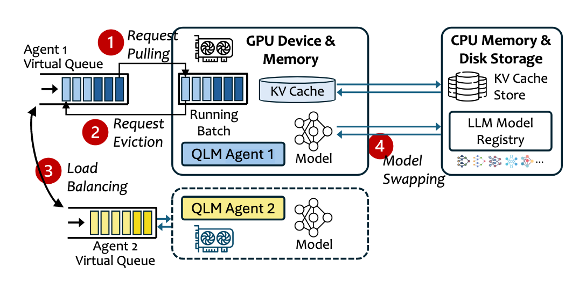
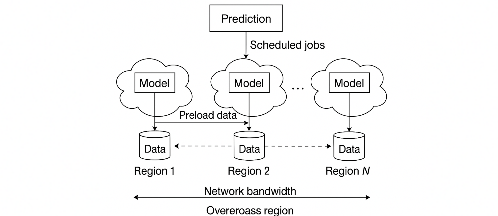
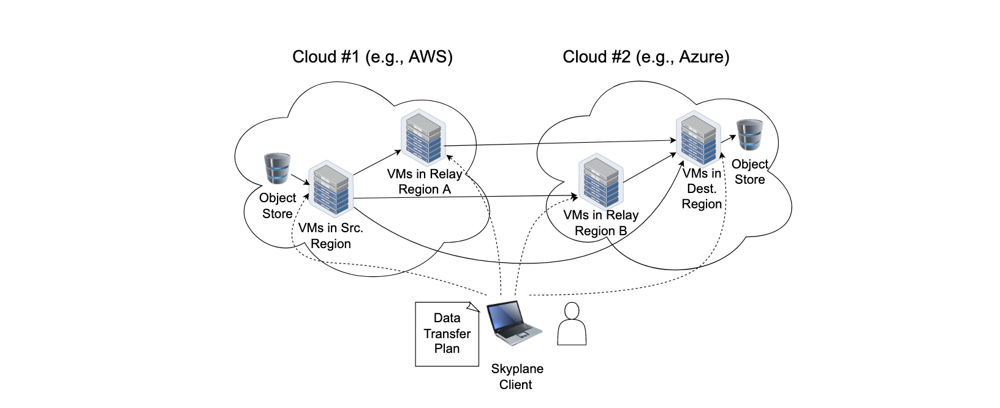
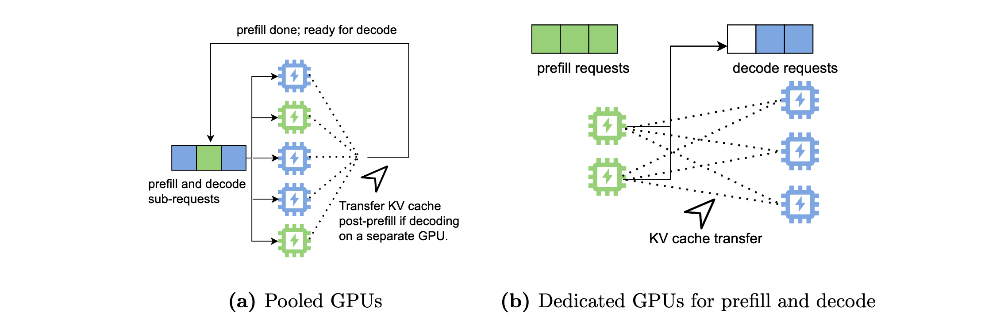
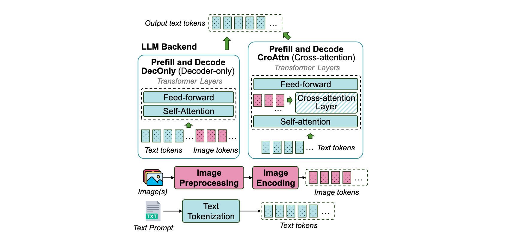
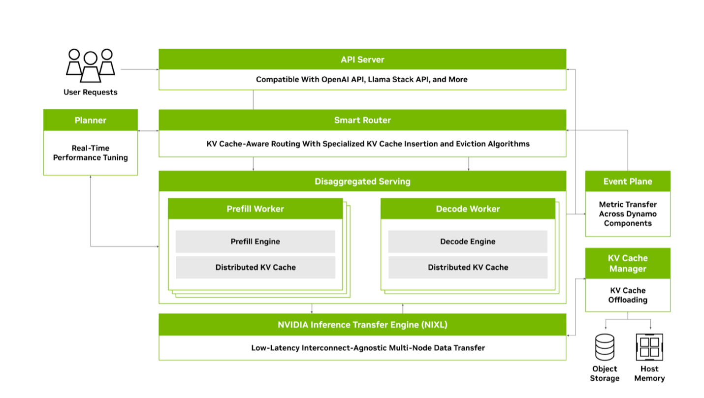
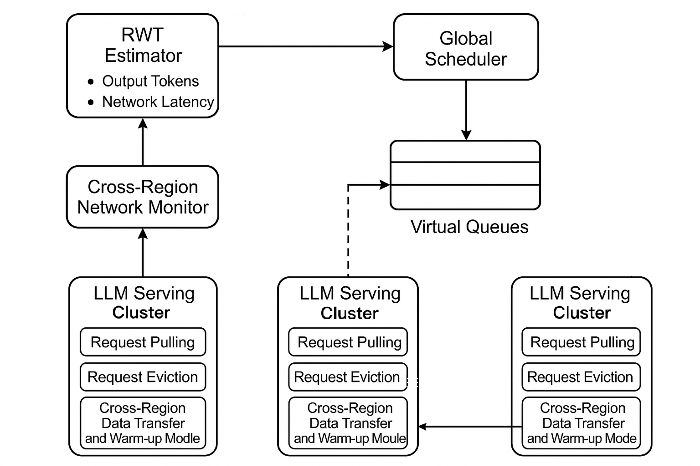

# SLO-Oriented Multi-Cluster LLM Serving

上周进展：

1. 阅读了 SkyServe 和 QLM 的开源代码
1. 增加调研范围

______________________________________________________________________

## **1. 背景**

随着大规模语言模型（LLM）推理服务需求的增长，所需的计算资源（如 GPU）规模不断扩大。为了在更多 GPU 上高效扩展推理服务，目前主要有两种技术路径：

1. **单服务扩展**：通过增大 PP 或 TP 的规模，减少单卡参数量以存储更多的 KV Cache，从而支持更大的批处理量（batch size），提升系统吞吐。然而，过大的 PP 或 TP 会引入显著的通信开销，成为性能瓶颈。（Eg：Leader Worker Set）
1. **多服务扩展 (Multi Server System)**：部署多个独立的模型推理实例，以数据并行（DP）的方式处理不同请求。与单服务扩展相比，多服务扩展虽然存在参数冗余，但显著降低了通信需求，更适合高并发场景。

为充分利用大规模 GPU 资源并平衡通信效率，多服务扩展成为必要的扩展方案。面临**负载均衡**、**资源利用率优化**以及**服务质量（如延迟与公平性）的协同保障**，亟需系统层面的设计与优化。

______________________________________________________________________

### 1.1 研究跨地域大模型推理的意义

| 意义             | 说明                                                                                              |
| ---------------- | ------------------------------------------------------------------------------------------------- |
| **资源稀缺性**   | 单区域可能无法提供足够的 GPU 资源以满足大规模推理需求，跨地域调度可整合分散资源，提升资源可用性。 |
| **成本优化**     | 不同区域的 GPU 定价存在差异，结合竞价实例可进一步降低计算成本。                                   |
| **容灾与高可用** | 跨地域部署可避免单点故障，增强服务的鲁棒性。                                                      |
| **用户就近服务** | 全球分布式部署可降低终端用户的请求延迟，提升体验。                                                |

______________________________________________________________________

### 1.2 跨地域大模型推理面临的挑战

| 挑战             | 说明                                                                                                                                                                                       |
| ---------------- | ------------------------------------------------------------------------------------------------------------------------------------------------------------------------------------------ |
| **负载均衡决策** | 跨区域网络延迟（约数百 ms）远高于同区域（\<1ms），可能显著影响推理效率。单一请求的完成时间等于等待时间、Prefill 时间、Decode 时间、以及跨区域网络延迟之和，即$C_{q}=W_{q}+P+D_{q}+L_{j}$。 |
| **数据同步**     | 模型权重等数据（KV Cache？）的跨地域传输可能引入额外带宽成本与延迟。                                                                                                                       |

由于跨地域的推理往往存在更多的时延，考虑面向 SLO 设计智能调度算法。

______________________________________________________________________

## **2. 相关工作**

### 2.1 LLM Serving 时间预测

请求时间预测对于优化调度、降低延迟至关重要。由于 LLM 请求的复杂性，其输出大小难以提前确定，这给预测带来了挑战。目前研究人员提出了多种方法，从不同角度尝试解决这一问题：

1. **基于辅助模型的预测**
1. **分类与回归方法**
1. **基于排序的方法**
1. **基于模型特性的预测**
1. **基于统计学方法的预测**

______________________________________________________________________

#### 2.1.1 基于辅助模型的预测

| 方法                | 优点                                                                         | 缺点                                                                               |
| ------------------- | ---------------------------------------------------------------------------- | ---------------------------------------------------------------------------------- |
| 辅助小 LLM 模型预测 | 能在一定程度上降低响应时间，提供了直接从请求内容预测响应规模的方法。         | 引入额外计算模型增加成本，需更多资源运行辅助模型及原始 LLM 模型。                  |
| 微调 BERT 模型预测  | 利用 BERT 的强大特征提取能力适应预测任务，对自然语言处理任务有良好泛化能力。 | 面对执行时间高度可变的请求时准确性下降，难以全面捕捉影响因素特别是请求复杂性高时。 |

______________________________________________________________________

#### 2.1.2 分类与回归方法

| 方法         | 优点                                                           | 缺点                                                                                      |
| ------------ | -------------------------------------------------------------- | ----------------------------------------------------------------------------------------- |
| 分类任务预测 | 简单直观，将连续输出大小转化为离散类别，便于处理和分析。       | 只能归类到有限的桶中，无法精确预测具体输出大小，不适合需要精确预测的场景。                |
| 回归方法预测 | 提供具体的预测值，相较于分类任务能够给出更详细的输出大小估计。 | 面对复杂多变的 LLM 请求时，可能难以准确捕捉各种因素与输出大小之间的关系，影响预测准确性。 |

______________________________________________________________________

#### 2.1.3 基于排序的方法

LTR 采用 Learning-to-Rank 方法，它并不直接预测请求的绝对输出大小，而是对请求基于其输出大小进行排序，从而使系统能够优先处理那些剩余令牌较少的请求。

这种方法的优势在于将重点放在请求的相对顺序上，避免了直接预测绝对大小的困难。

但它也存在缺陷，在排序时只考虑了输出大小，忽略了提示的大小。这就可能导致在预填充阶段，当一个输出短但提示长的请求排在前面时，会出现头阻塞现象，影响系统的整体性能。

______________________________________________________________________

#### 2.1.4 基于模型特性的预测

Trail 利用 LLM 输出生成的自回归特性，通过回收 intermediate transformer layers 的 embeddings，并使用轻量级线性分类器处理这些 embeddings 来估计剩余输出大小。

这种方法巧妙地结合了 LLM 模型自身的特点，避免了使用单独的大小预测模型，在一定程度上提高了预测的效率。同时，Trail 还根据请求执行过程中 KV 缓存的变化情况，对预占策略进行调整，以平衡预占带来的内存开销和延迟优化效果。

______________________________________________________________________

#### 2.1.5 基于统计学方法的预测

RWT 估计器是 QLM 中的关键组件，用于估计请求等待时间，为优化请求队列排序、提高系统性能提供支持。它的原理基于统计学方法，通过对请求处理过程中各个时间因素的分析和估计来实现。同时，它通过离线分析和对硬件及模型相关参数的考虑，具备支持多种 GPU 和多种模型的能力。

RWT 估计器采用统计方法生成请求等待时间和完成时间的估计值：

1. **计算请求完成时间**
1. **估计请求组完成时间**
1. **支持多种 GPU 和多种模型**

______________________________________________________________________

##### 2.1.5.1 计算请求完成时间

总请求完成时间$C_{q}$由等待时间$W_{q}$、预填充时间$P$及所有输出令牌的总解码时间$D_{q}$组成，即$C_{q}=W_{q}+P+D_{q}$。

预填充时间$P$在输入令牌较少时为常数，因其是高度并行的 GPU 加速操作；随输入令牌增加，$P$增长幅度极小。等待时间$W_{q}$计算公式为$W_{q}=\sum_{i = 1}^{q - 1}\frac{O_{i}}{\Theta}$，其中$\Theta$为令牌生成吞吐量（视为常数），$O_{i}$代表队列中前序请求的输出令牌数量。

由于$O_{i}$未知，采用基于历史数据拟合的分布建模，其均值为$\mu_{o}$，标准差为$\sigma_{0}$；随着$q$增大，该分布趋近正态分布。解码时间$D_{q}$通过$D_{q}=O_{q}×\epsilon×d$计算，使用模型的最大可能输出令牌数近似$O_{q}$。

- **长队列情况**：等待时间$W_{q}$在总完成时间$C_{q}$中占比增大，误差减小；
- **短队列情况**：因解码时间占主导，使用保守估计，使用模型的最大可能输出令牌数量进行近似。

______________________________________________________________________

##### 2.1.5.2 估计请求组完成时间

要估计整个请求组的完成时间，需取组内所有单个请求完成时间的最大值，即$C = max_{q}C_{q}$ 。全局调度器结合每个实例的等待情况，进行负载调度。

______________________________________________________________________

##### 2.1.5.3 支持多种 GPU 和多种模型

RWT 估计器通过以下机制支持多种 GPU 和多种模型。（这部分代码没有开源）

- **离线分析**：包括工作负载分析和硬件分析两个独立步骤。工作负载分析从工作负载中采样多个请求，生成输入和输出令牌的分布；硬件分析则需要在特定 GPU 上使用单批请求运行模型，直接从 LLM 服务实例记录与模型和硬件设置相关的固定变量，如预填充时间$P$、低效因子$\epsilon$和解码时间每迭代$d$ 。在实际实现中，这些记录指标直接添加到 vLLM 代码中。通过这种离线分析，RWT 估计器能够获取不同模型和 GPU 的相关参数，为准确估计等待时间提供基础。
- **考虑硬件和模型异质性**：在估计过程中，RWT 估计器会考虑不同 GPU 的计算能力、内存容量和内存带宽，以及不同模型的计算需求、SLO 和令牌长度分布等因素。对于不同的 GPU，其令牌生成吞吐量$\Theta$会有所不同，RWT 估计器会根据离线分析得到的参数，对不同 GPU 上的请求等待时间进行准确估计。对于不同模型，预填充时间$P$、解码时间每迭代$d$等参数也会不同，RWT 估计器同样会考虑这些差异，从而实现对多种 GPU 和多种模型的支持。

______________________________________________________________________

### 2.2 数据/模型优化

#### 2.2.1 跨区域

##### 2.2.1.0

- **SkyServe**：没有提到数据传输成本问题，通过多副本保障可用性
- **Singularity**：做了较多的假设（GPU 完全动态），提到对数据进行压缩

##### 2.2.1.1 MAST

- **数据复制**：为每张表在主区域外选区域存储副本，考虑区域故障概率和硬件可用性；针对数据与 GPU 不匹配无法运行的作业，在其他区域创建额外表副本；对热表按 GPU 类型广泛复制以平衡负载，为 MAST 快速路径选作业托管区域提供灵活性，减少因数据不可用导致的跨区域数据传输需求。
- **数据传输**：使用数据迁移服务执行跨区域数据复制，设置软期限，数据迁移服务依此分配带宽，并且跨区域流量采用差异化服务质量，避免影响在线服务。

______________________________________________________________________

##### 2.2.1.2 字节跳动

在线训练作业需求可预测，可结合空闲带宽，提前加载数据到资源空闲区域

______________________________________________________________________

##### 2.2.1.3 SkyPlane

- 通过选择合适的中继区域和结合多个路径来降低成本。
- 使用并行 TCP 连接和多个 VM 来提高带宽。

______________________________________________________________________

##### 2.2.1.4 跨区域数据传输问题小结

网络延迟问题纳入 TTFT（Time to first token）和 TPOT（Time per output token）的考虑因素，对于模型权重等需要跨区域同步的数据：

1. **动态数据副本**：对高频访问的模型保持数据热副本
1. **预加载+流式传输**：利用空闲带宽预传数据
1. **模型分块**：分别加载基础模型 + 微调后的权重？

______________________________________________________________________

#### 2.2.2 集群内

##### 在多个 Server 之间传输 KV-Cache

阿里 PAI 2024：Llumnix: Dynamic Scheduling for Large Language Model Serving.
Infinite-LLM: Efficient LLM Service for Long Context with DistAttention and Distributed KVCache

##### 面向 Prompt 的调度

Locality-aware Fair Scheduling in LLM Serving.
WukLab (SkyLab) 2024: Efficient Prompt Scheduling for Augmented Large Language Models

______________________________________________________________________

##### Memory-Offloading

阿里 & 北大 arxiv 2025：Memory Offloading for Large Language Model Inference with Latency SLO Guarantees
Queue Management for SLO-Oriented Large Language Model Serving：

- 多模型 Offloading
- 在基于 vLLM 的实现中，QLM 代理负责触发模型交换操作。当需要进行模型交换时，将 vLLM 实例的底层模型进行更改，并刷新 KV 缓存，从而完成模型从 内存 到 显存 的交换过程。

______________________________________________________________________

##### PD 分离

- [OSDI'24] DistServe **improves the performance of large language models** (LLMs) serving by disaggregating the prefill and decoding computation.
- Mooncake: A KVCache-centric Disaggregated Architecture for LLM Serving
  - 公开 KVCache Trace：[Mooncake/tree/main/FAST25-release/traces](https://github.com/kvcache-ai/Mooncake/tree/main/FAST25-release/traces)
- DeepSeek

______________________________________________________________________

##### 多模态

微软 2025：ModServe: Scalable and Resource-Efficient Large Multimodal Model Serving

______________________________________________________________________

##### 开源工作

- [vLLM Production Stack](https://github.com/vllm-project/production-stack)
- [Dynamo](https://github.com/ai-dynamo/dynamo/blob/main/docs/architecture.md)：PD 分离 / KV 感知路由 / KV cache 多级存储管理

______________________________________________________________________

## **3. 对跨区域 LLM Serving 的启示**

请求完成时间（考虑 GPU 异构性+跨区域网络延迟？）：

$$
C_q = \frac{N_p + \sum{\bar{N}_{p}}}{v_p^{(k)}} + \frac{N_o + \sum{\bar{N}_{o}}}{v_d^{(k)}} + L_j + M_q \cdot \mathbb{I}_{\text{remote}}(j)
$$

效能公式：

$$
E_q = \underbrace{\min{C_q}}_{\text{最大 SLO 满足}} + \alpha \cdot \left( \underbrace{\left( \frac{N_p}{v_p^{(k)}} + \frac{N_o}{v_d^{(k)}} \right) \cdot c_k}_{\text{GPU 计算成本}} + \underbrace{D_q \cdot b_j \cdot \mathbb{I}_{\text{remote}}(j)}_{\text{跨区域带宽成本}} \right)
$$

______________________________________________________________________

| 符号                            | 含义                                                     |
| ------------------------------- | -------------------------------------------------------- |
| $N_p$                           | 输入提示词（prompt）的 token 数量                        |
| $v_p^{(k)}$                     | GPU 类型$k$的预填充处理速度（每毫秒处理的 token 数）     |
| $N_o$                           | 请求$q$的预测输出 token 数量（可通过多种方法预估）       |
| $v_d^{(k)}$                     | GPU 类型$k$的自回归解码速度（每毫秒生成的 token 数）     |
| $L_j$                           | 区域$j$的网络传输延迟（含往返 RTT 和数据序列化开销）     |
| $Q_j$                           | 区域$j$当前队列中的请求数量                              |
| $\bar{N}_o$                     | 该区域历史平均输出 token 数（用于估算排队延迟）          |
| $M_q$                           | 跨区域数据迁移惩罚时间（如 KV Cache 传输、模型权重同步） |
| $\mathbb{I}_{\text{remote}}(j)$ | 区域指示函数（本地区域为 0，远程区域为 1）               |

______________________________________________________________________

Q1: 要考虑的因素很多，怎么找到最关键的问题？

1. GPU 异构性
1. 不同 SLO（TTFT 要求、TPOT 要求、JCT 要求）
1. 为了强调跨区域的数据传输，是否引入多模型？
1. 单集群/区域内的调度策略怎么调整？比如 P 和 D 比例
1. KVCache 跨区域传输的收益有多少？KVCache 预热是否可行？

______________________________________________________________________

______________________________________________________________________

### 下一步计划

- 具体查看 vLLM Production Stack 或 Dynamo
- 动机实验
- SLO 具体的定义
- Model Swapping
- 效能公式
